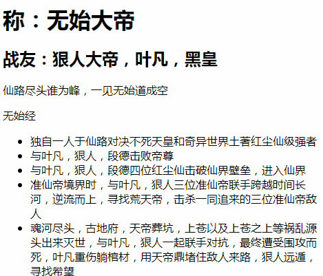

# mvvm-vdom-diff

尝试将<a href="https://github.com/lizhongzhen11/mvvm">mvvm</a>与<a href="https://github.com/lizhongzhen11/virtual-dom-with-diff">virtual-dom-with-diff</a>结合，`diff` 和 `patch` 方法写的并不好，没有考虑属性以及双向绑定还有事件等等。

离vue差十万八千里，但总的来说是一种尝试。加深理解吧

